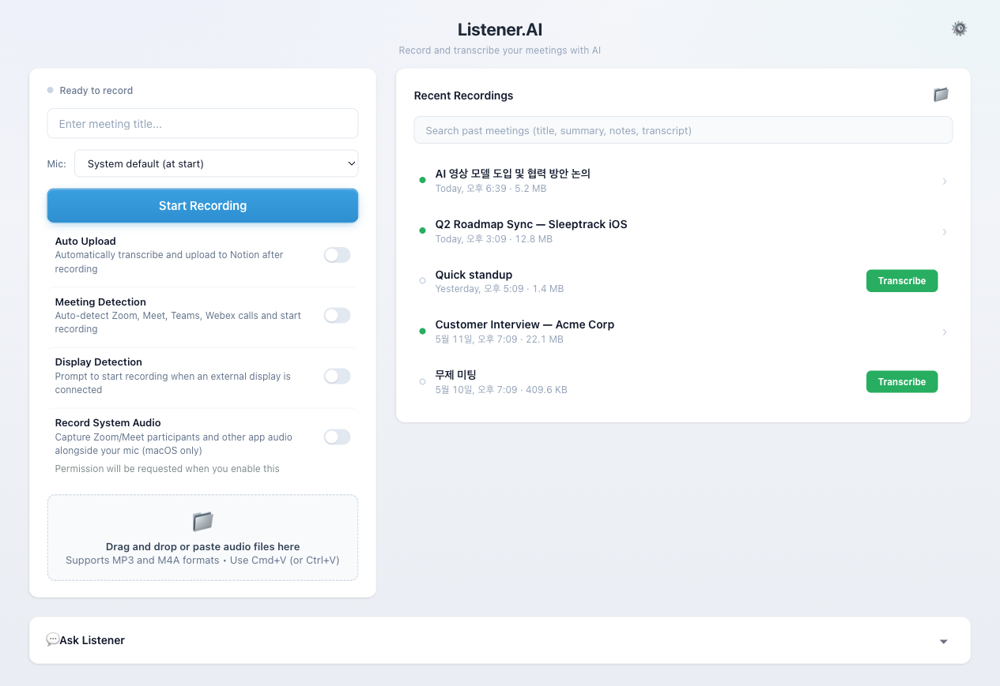
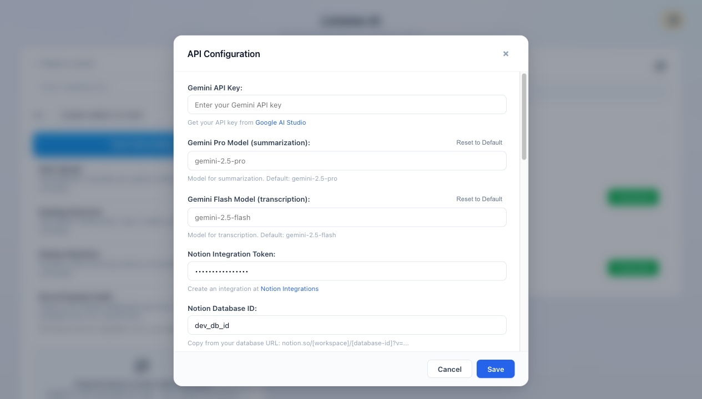

# Listener.AI

Listener.AI is a desktop meeting recorder and CLI that turns audio into searchable AI meeting notes. It records meetings, imports existing audio, transcribes with Gemini, generates Korean summaries, key points, and action items, then keeps everything in a local archive you can send to Notion or Slack.

Available as a **desktop app** via [GitHub Releases](https://github.com/asleep-ai/listener-ai/releases) and as a **CLI tool** via npm.



## What It Does

1. Record a meeting from your microphone, or import an existing audio file.
2. Capture timestamped live highlights while the meeting is running.
3. Transcribe the audio and generate a structured meeting note.
4. Search, reopen, merge, export, or re-transcribe past recordings.
5. Share completed notes to Notion or Slack when your integrations are configured.

## Desktop App

Download from [GitHub Releases](https://github.com/asleep-ai/listener-ai/releases):

- **macOS**: Intel (x64) and Apple Silicon (arm64) DMG
- **Windows**: x64 installer

The desktop app includes:

- One-click recording with meeting title, mic selection, and elapsed timer
- Optional macOS system audio capture for Zoom, Meet, Teams, browser tabs, and other app audio
- Drag-and-drop or paste import for audio files
- Live highlights and timestamped flags during recording
- Recent recordings with search, transcript status, merge, Finder reveal, and M4A export actions
- Meeting detection and external display prompts for recording automation
- Automatic FFmpeg setup when transcription needs it
- Local configuration shared with the CLI



## CLI

### Install

```bash
npm install -g listener-ai
```

Or use directly:

```bash
npx listener-ai <audio-file>
```

### Prerequisites

- **FFmpeg** installed on your system (`brew install ffmpeg` / `apt install ffmpeg`)
- **Google Gemini API key** from [Google AI Studio](https://makersuite.google.com/app/apikey)

### Setup

```bash
listener config set geminiApiKey <your-key>
```

Optional Notion integration:

```bash
listener config set notionApiKey <your-key>
listener config set notionDatabaseId <your-id>
```

Optional Slack integration:

```bash
listener config set slackWebhookUrl <your-webhook-url>
listener config set slackAutoShare true  # Auto-share when auto mode is enabled
```

### Usage

```bash
listener recording.mp3                # Transcribe to the default output directory
listener recording.m4a --output ./    # Transcribe to the current directory
listener transcript recording.wav     # Print transcript to stdout without summary
listener transcript recording.wav -o out.txt
                                      # Write transcript to a file
listener transcript recording.wav --prompt "Translate to English while transcribing"
                                      # Override the default transcription instruction
listener list                         # List saved transcriptions
listener show <ref>                   # Print a saved meeting summary
listener search "roadmap"             # Search past meeting notes
listener export <ref> --transcript    # Export a saved note with transcript
listener merge <ref1> <ref2>          # Merge and re-transcribe multiple notes
listener ask "What did we decide?" --ref <ref>
                                      # Ask about a saved meeting
listener config list                  # Show all config values with secrets masked
listener config get <key>             # Print one config value
listener config set <key> <value>     # Set a config value
listener config unset <key>           # Clear a config value
listener config path                  # Print config file path
listener --version                    # Print CLI version
listener --help                       # Show usage
```

Supported formats: mp3, m4a, wav, ogg, flac, aac, wma, opus, webm

Full meeting-note output is a folder containing `transcript.md` and `summary.md` with speaker identification, Korean summary, key points, and action items. Transcript-only output can print plain text to stdout or write directly to a file.

## Configuration

Config is stored in your system application data folder:

- **macOS**: `~/Library/Application Support/Listener.AI/config.json`
- **Windows**: `%APPDATA%/Listener.AI/config.json`
- **Linux**: `~/.config/Listener.AI/config.json`

CLI and desktop app share the same config file.

### Getting API Keys

#### Google Gemini API

1. Visit [Google AI Studio](https://makersuite.google.com/app/apikey)
2. Click "Create API Key"
3. Copy the generated key

#### Notion Integration

1. Go to [Notion Integrations](https://www.notion.so/my-integrations)
2. Create a new integration named "Listener.AI"
3. Grant permissions: Read, Insert, Update content
4. Copy the "Internal Integration Token"
5. Share your database with the integration
6. Get database ID from URL: `notion.so/workspace/DATABASE_ID`

#### Slack Integration

1. Create a Slack app with an Incoming Webhook.
2. Add the webhook to the channel where meeting notes should be posted.
3. Copy the webhook URL and save it with `listener config set slackWebhookUrl <url>`.

## Development

```bash
pnpm install
pnpm run start        # Run Electron app
pnpm run dev:renderer # Run renderer-only preview with sample data
pnpm run cli          # Run CLI locally
pnpm run dist:mac     # Build macOS
pnpm run dist:win     # Build Windows
```

## License

MIT
